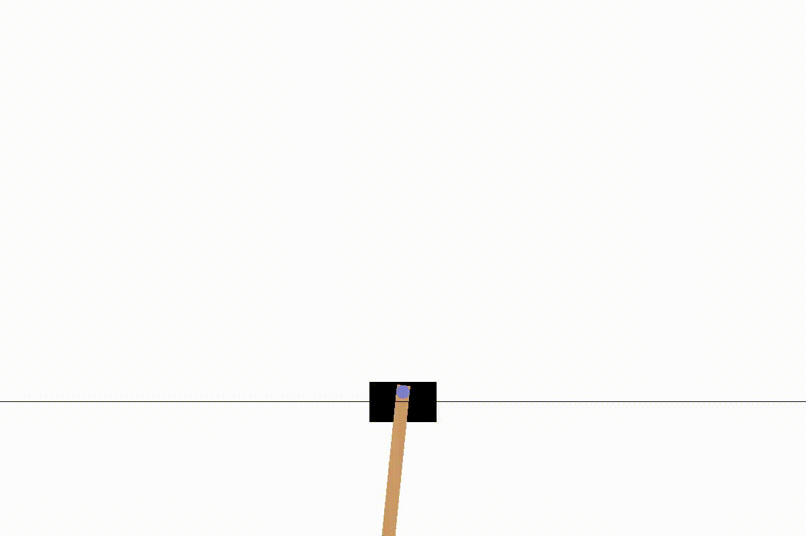

## 2023 Spring CS4789 Programming Assignment 2: CartPole Control with LQR Method
## Refactored by Toni Liu, 2023 March 4th 




This package implements Linear Quadratic Regulator (LQR) methods for control tasks, including both standard LQR for linear control tasks and an iterative LQR (iLQR) approach for more complex, non-linear tasks such as the swing-up problem.

To stabilize policy updates during dynamic programming, we use a technique known as linear policy mixing.

Key Additions and Changes
Here are the new methods and functions introduced in the refactored version:

**lqr.py**
- ilqr(ABmQRMqrb_list)
- cartpole_controller.py:

**cartpole_controller.py**
- policy_mixture(l1, l2, alpha=1/2)
- linearized_traject(self, s_ini, policy_list, delta = 1e-7)
- compute_global_policy(self, s_ini, T, N)

**cartpole.py**
- New option: flag == 'iLQR'

**cartpole.py**
- new option: flag == 'iLQR'


## Usage

* run and show the cartpole environment. (also generate a video under directory ./gym-results)
```
  $ python cartpole.py
```
* test different initial states
```
  $ python test.py
```
